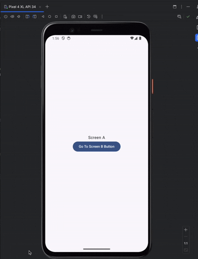

# This is the buggy version of the project. 

The medium article in which the issue was explained is provided at:

The video of the issue can be seen below.

| :feature:auth                       |
|-------------------------------------|
|  |

